# ProductReview Application Architecture Iteration Report

## Introduction

The ProductReview application's transition to a microservices architecture is a pivotal move to enhance its scalability and efficiency. This shift addresses critical
non-functional requirements while maintaining the application's core functionalities.

## Architectural Strategy

### Deployment and Infrastructure

The Deployment and Infrastructure Model illustrates the server and service structure of the ProductReview application. It details the interaction between various
services and their respective databases, as well as external API integration.

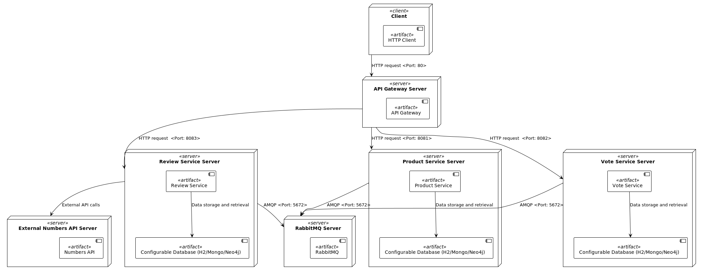

#### Structure and Communication

- **Client**:
    - Interacts with the application through an HTTP client.
    - Sends requests to the API Gateway.

- **API Gateway Server**:
    - Central hub for routing HTTP requests to appropriate microservices.
    - Exposes standard Port 80 for incoming requests.

- **Service Servers (Product, Review, Vote)**:
    - Host individual microservices: Product, Review, and Vote services.
    - Each server has a configurable database, supporting H2, MongoDB, or Neo4j.
    - Handles data storage and retrieval operations.

- **RabbitMQ Server**:
    - Manages message queuing and inter-service communication using AMQP protocol.
    - Connects with Product, Review, and Vote services.

- **External Numbers API Server**:
    - Review Service Server makes external API calls to the Numbers API.

#### Communication Flow

- Client sends HTTP requests to the API Gateway.
- API Gateway routes requests to the respective Product, Review, or Vote service based on the request type.
- Each service performs operations and interacts with its respective database.
- Review Service makes external calls to the Numbers API for additional functionalities.
- Services communicate with each other and manage asynchronous tasks through RabbitMQ.

#### Chosen Approach Overview

The deployment and infrastructure approach for the ProductReview application is designed around a microservices architecture. Key components include a central API
Gateway, individual service servers for Product, Review, and Vote, an external Numbers API, and RabbitMQ for message queuing. Each service is associated with a
configurable database.

Reasons for Choosing This Approach:

- **Microservices Architecture**: Enhances modularity, making the system more maintainable and scalable. Each microservice can be developed, deployed, and scaled
  independently.
- **API Gateway**: Centralizes request routing, providing a single entry point for all client requests, simplifying the client-side logic.
- **Configurable Databases**: Offering the flexibility to choose between H2, MongoDB, or Neo4j allows the system to adapt to different data storage requirements and
  scenarios.

Alternatives Considered

- **Serverless Architecture**: Provides automatic scaling and reduced operational overhead but could introduce vendor lock-in and latency issues for certain
  operations.
- **Direct Client-to-Service Communication**: Could eliminate the need for an API Gateway but at the cost of increased complexity on the client side and potential
  security risks.

Scalability and Elasticity

- **Independent Scaling**: Each microservice can be scaled independently based on demand, avoiding the need to scale the entire application.
- **Load Balancing**: The API Gateway can distribute load evenly among multiple instances of a service, enhancing performance during peak traffic.
- **Elastic Infrastructure**: Using containerization (like Docker) and orchestration tools (like Kubernetes), the infrastructure can automatically adjust the number
  of service instances in response to the load.

Advantages of the Approach

- **Flexibility in Data Management**: Different microservices can use different database systems that are best suited to their specific data access patterns.
- **Resilience**: Microservices are isolated, so the failure of one service doesn't bring down the entire application.
- **Rapid Development and Deployment**: Microservices can be developed and deployed independently, enabling faster iterations and continuous deployment.

Potential Enhancements

- **Service Mesh Implementation**: Introducing a service mesh like Istio or Linkerd can provide advanced traffic management, security features, and observability
  across microservices.
- **Advanced Monitoring and Logging**: Implementing comprehensive monitoring and logging solutions for better observability and troubleshooting.

#### CI/CD Automation

The proposed CI/CD pipeline is designed to align with the microservices architecture of the project. It emphasizes automated testing, containerization, and staged
deployments, ensuring rapid, reliable, and scalable software delivery.

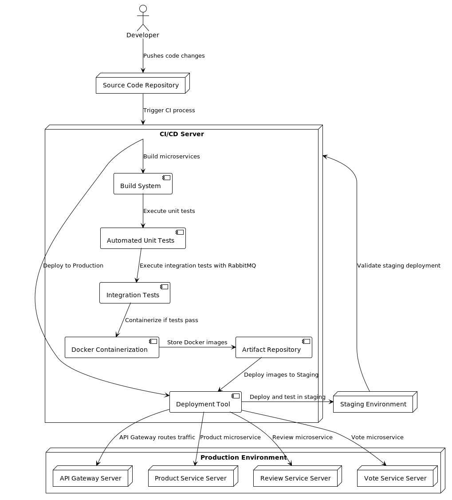

1. **Microservices-Specific Pipeline**: Each microservice is built, tested, and deployed independently, which aligns with the principles of microservices
   architecture. This ensures agility and minimizes risk as changes in one service don't directly impact others.

2. **Automated Testing**:

- **Unit Testing**: Validates individual components for correctness.
- **Integration Testing with RabbitMQ**: Ensures that the services interact correctly, particularly with the message broker, crucial for asynchronous communication
  in microservices.

3. **Docker Containerization**: Containers encapsulate each microservice, making them portable and consistent across environments. This is essential for
   microservices that may use different technology stacks.

4. **Staging Environment**: A critical step for pre-production verification. It serves as a final check to ensure that new changes integrate well in an environment
   that closely mirrors production.

5. **Artifact Repository**: Storing Docker images in a central repository simplifies version control and deployment processes.

6. **Production Deployment**:
    - Gradual deployment to production minimizes downtime.
    - The API Gateway efficiently routes traffic and manages communication between services.

Alternative Approaches

1. **Canary Releases**: Gradually rolling out changes to a small subset of users before a full-scale rollout. This can be an additional layer in the pipeline to
   further reduce deployment risks.

2. **Blue/Green Deployment**: Maintaining two identical environments where one is active (Blue), and the other (Green) is updated and ready to switch over. This
   approach can ensure zero downtime but requires more resources.

3. **Feature Toggles**: Releasing features hidden behind flags or toggles. This allows for easier rollbacks and testing in the production environment without
   affecting end-users.

The pipeline supports scalability and elasticity in several ways:

- **Independent Scaling**: Each microservice can be scaled independently based on demand, due to the use of Docker containers.
- **RabbitMQ Integration**: Ensures that the messaging infrastructure can scale to handle inter-service communication effectively.
- **Automated Deployment**: Facilitates quick scaling up or down of services in response to load changes.

In summary, this CI/CD pipeline is tailored for a microservices architecture, fostering quick, safe, and scalable software delivery, which is vital for the dynamic
nature of modern web applications.

#### Dockerization

Each service is dockerized and deployed as a container with its own database.

### High-Level Goals

The primary objective is to craft an architecture capable of:

- Handling increased loads
- Efficient hardware utilization
- Frequent and reliable releases
- API stability
- Adherence to SOA and API-led connectivity

## Microservices Architecture

### Service-Specific Design

For the ProductReview application, the following services have been identified as candidates for microservices:

- User Service
- Product Service
- Review Service
- Vote Service
- Approval Service

To make the routing of requests to the appropriate service easier, the API Gateway has been implemented as a microservice. The API Gateway is the only component
that is exposed to the outside world. All requests to the application are routed through the API Gateway, which then forwards the request to the appropriate

While the User Service was a candidate for a microservice, it was not implemented as one due to time constraints. The User Service is a critical
component of the application, and its implementation as a microservice would have required significant effort. The User Service is a centralized component
that handles authentication and authorization for the entire application. It is a critical component that is used by all other services. As such, it is a single
point of failure and a potential bottleneck. However, the User Service is a relatively simple component that can be easily scaled up to handle increased
loads. It is also a stable component that is unlikely to undergo frequent changes. As such, it was not implemented as a microservice and instead was integrated into
the API Gateway.

The approval service was also implemented in each of the services that require it.

### Databases

The ProductReview application uses three different databases:

- MongoDB
- Neo4j
- H2

Each service has its own database.

#### Polyglot Persistence

- The services support polyglot persistence by integrating different database models (MongoDB, Neo4j, and H2) through respective drivers and
  repositories. This allows for flexible data management and storage according to the application's needs.

#### Ideal Database for Each Service

- **API Gateway (User-Related Functionalities):**
    - **Database:** H2 Database
    - **Explanation:** The API Gateway, handling user-related functionalities, utilizes the H2 database. H2, being an in-memory database, offers fast data access and
      processing, which is crucial for authentication and user data handling. Its lightweight nature and ease of deployment make it an excellent choice for the API
      Gateway, where speed and efficiency are critical. The relational model of H2 is well-suited for structured user data, ensuring reliable and consistent
      transactions.

- **Product Service:**
    - **Database:** MongoDB
    - **Explanation:** MongoDB, a document-based database, is used for the Product Service. This service manages diverse product information, potentially involving
      varied and complex data structures. MongoDB's flexible schema and efficient handling of JSON-like documents make it ideal for storing and retrieving dynamic
      product data. Its scalability and agility in accommodating changes are beneficial for managing the evolving nature of product information.

- **Review Service:**
    - **Database:** Neo4j
    - **Explanation:** The Review Service employs Neo4j, a graph database, to manage the intricate relationships between products, users, and reviews. Neo4j excels
      in handling connected data and complex relationships, offering efficient data traversal and relationship querying capabilities. This is particularly
      advantageous for analyzing user behavior, review patterns, and understanding product-review-user interactions in depth.

- **Vote Service:**
    - **Database:** MongoDB
    - **Explanation:** MongoDB is also utilized for the Vote Service. Given the service's requirement for handling high volumes of user votes, MongoDB's performance
      in terms of high-throughput read and write operations is beneficial. Its ability to handle large datasets and provide quick data access aligns well with the
      Vote Service's needs, where responsiveness and scalability are key.

### API Gateway

Centralized request handling and authentication management.

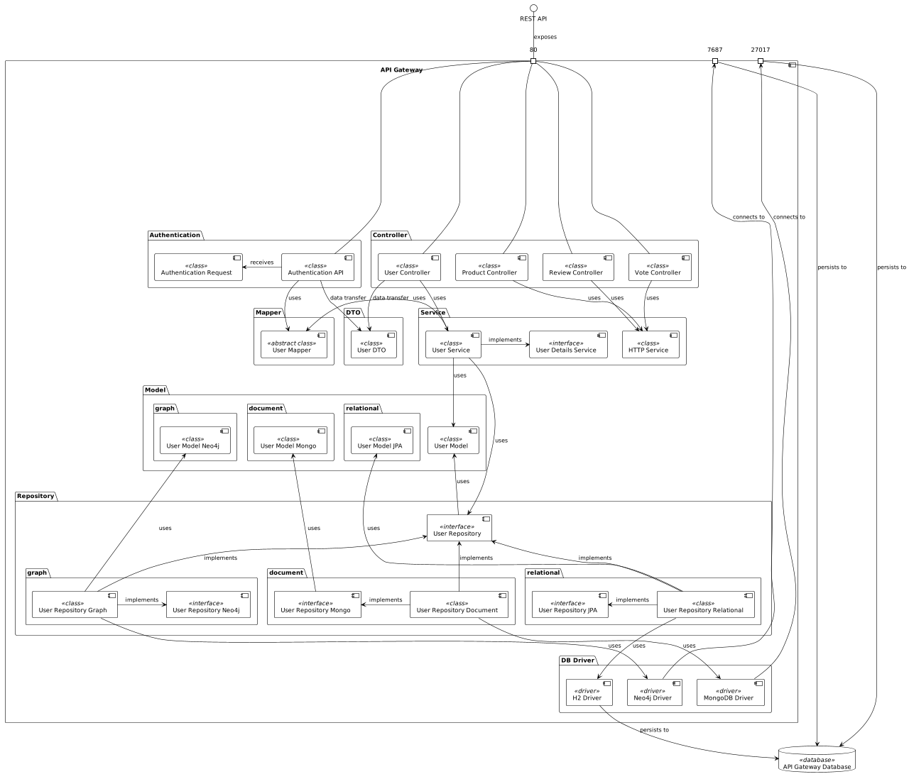

- **Port 80 (REST API):** This port exposes the API Gateway's REST API, serving as the entry point for all incoming requests.

- **Controllers:**
    - **User Controller:** Manages user-related requests.
    - **Product Controller:** Routes product-related requests to the Product Service.
    - **Review Controller:** Routes review-related requests to the Review Service.
    - **Vote Controller:** Routes vote-related requests to the Vote Service.

- **Authentication API:** Responsible for authenticating requests and managing security aspects.

- **Authentication Request:** Handles incoming authentication requests.

- **User Mapper:** Abstract class responsible for mapping user data across different data models.

- **User Services:**
    - **User Details Service:** An interface that defines user-related operations.
    - **HTTP Service:** A class for handling HTTP communications.
    - **User Service Implementation:** Implements the User Details Service.

- **User DTO (Data Transfer Object):** Facilitates the transfer of user data.

- **User Models:**
    - **User Model Mongo, JPA, Neo4j:** Specific user models for different database types.

- **User Repositories:**
    - **User Repository:** General interface for user data operations.
    - **User Repository Document, Relational, Graph:** Specific repository implementations for different databases.

- **Database Drivers:**
    - **MongoDB, Neo4j, H2 Drivers:** Drivers for connecting to respective databases.

- **Database Ports:** Ports for connecting to MongoDB (27017) and Neo4j (7687).

#### Authentication and Routing Functionality

- **Authentication Handling:** The Authentication API within the API Gateway is the primary component for authenticating incoming requests. It ensures that requests
  are valid and secure before routing them to the respective services.

- **Request Routing:** The API Gateway routes requests to the appropriate microservices (Product, Review, Vote) based on the request path and parameters. This
  centralizes the request handling and simplifies the client-side interactions.

- **User Management:** The User Controller, along with User Services and Repositories, manages user data, ensuring that user information is accurately processed and
  stored in the API Gateway Database.

### Product Service

The **Product Service** is a core component of the ProductReview application, responsible for managing all product-related functionalities.

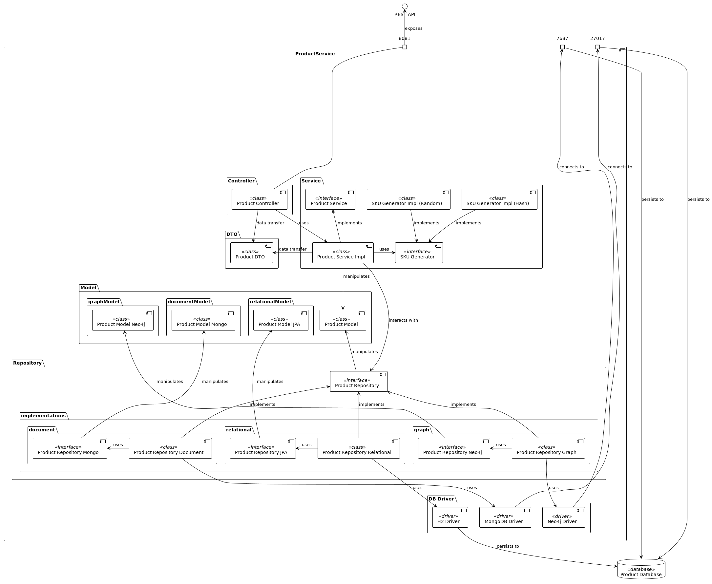

- **Product Controller**:
    - Serves as the entry point for all product-related API requests.
    - Delegates tasks to the appropriate service layer.

- **Product and SKU Generator Services**:
    - Manage the business logic related to products and SKU generation.
    - Product Service handles CRUD operations, while SKU Generator is responsible for unique SKU creation.

- **Data Transfer Objects (DTOs)**:
    - Facilitates efficient and secure data transmission between layers.

- **Product Model**:
    - Represents the data structure for products within the application.
    - Supports various database models (MongoDB, JPA, Neo4j) for versatile data management.

- **Repository Layer**:
    - Manages data access and database interactions.
    - Adopts a polyglot persistence approach for optimal data handling.

- **Database Drivers**:
    - Connects the service with different databases: MongoDB, Neo4j, and H2.
    - Ensures efficient and reliable database operations.

The Product Service architecture demonstrates microservices principles, focusing on modularity, scalability, and database interoperability, crucial for the efficient
management of product data in the ProductReview application.

### Review Service

The **Review Service** in the ProductReview application is pivotal for managing user reviews and ratings, ensuring efficient processing and adaptability.

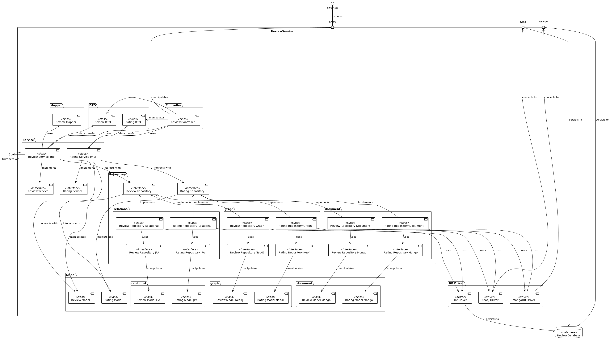

- **Review Controller**:
    - Interfaces with all review-related operations.
    - Directs requests to the appropriate service layers.

- **Review and Rating Services**:
    - Handle the business logic for reviews and ratings.
    - Manage adding, updating, and retrieving data.

- **Data Transfer Objects (DTOs)**:
    - Ensure consistent and integral data transfer across layers.

- **Review Mapper**:
    - Facilitates seamless data format translation.

- **Review and Rating Models**:
    - Represent data structures within the system.
    - Crucial for data manipulation and implementing business logic.

- **Repository Layer**:
    - Acts as the data access layer.
    - Supports a polyglot persistence strategy.

- **Database Drivers**:
    - Ensure effective connection and data operations with MongoDB, Neo4j, and H2 databases.

The architecture exemplifies microservices principles, focusing on modularity, scalability, and efficiency. It plays a crucial role in the ProductReview application.

### Votes Service

The Vote Service is an integral component of the ProductReview application, dedicated to efficiently managing user voting activities. It ensures a seamless and
robust voting process for users, capable of handling high volumes of voting interactions.

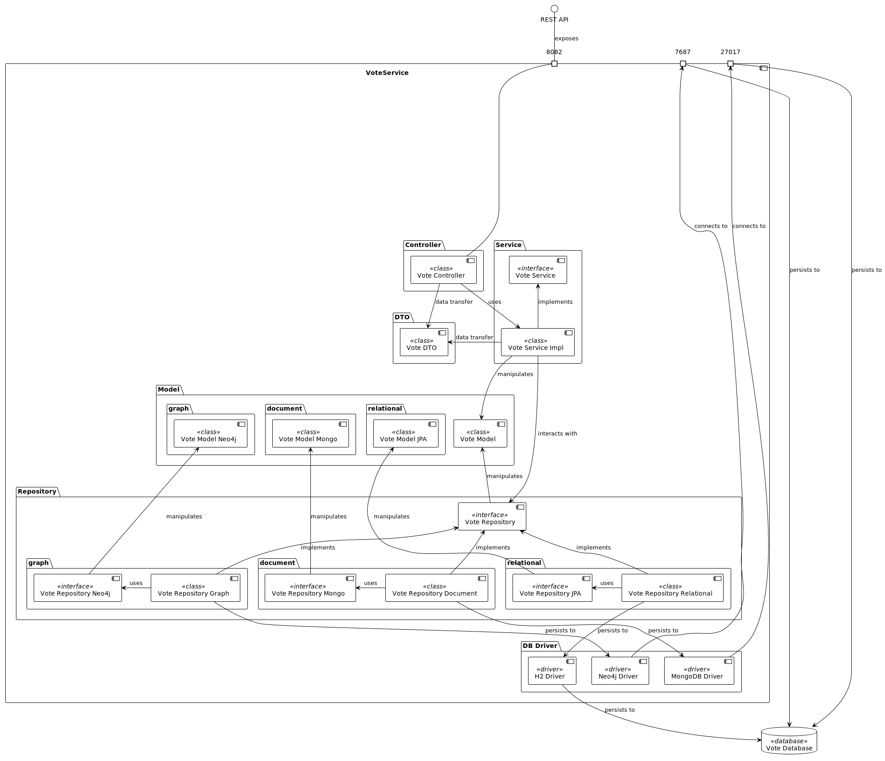

- **Vote Controller:**
    - Serves as the gateway for all voting-related requests.
    - Directs these requests to the appropriate internal services for processing.

- **Vote Service and Its Implementation:**
    - Defines the business logic associated with vote management.
    - Handles specific functionalities such as casting votes, tallying votes, and updating vote records.

- **Data Transfer Object:**
    - Enables smooth data communication between different layers of the service, particularly in data exchange between the controller and the service layers.

- **Vote Model:**
    - Represents the voting data structure within the system.
    - Utilized by the service layer for managing and manipulating vote-related data.

- **Repository Layer:**
    - Acts as a data layer abstraction, allowing seamless interactions with the database.
    - Accommodates various database types (document-based, relational, graph-based) to enhance flexibility and scalability.

- **Database Drivers:**
    - Facilitate interactions with diverse databases, such as MongoDB, Neo4j, and H2.
    - Ensure efficient data storage and retrieval for the vote management process.

## Addressing Functional Requirements

Key functionalities are addressed as follows:

### Product Publishing Process

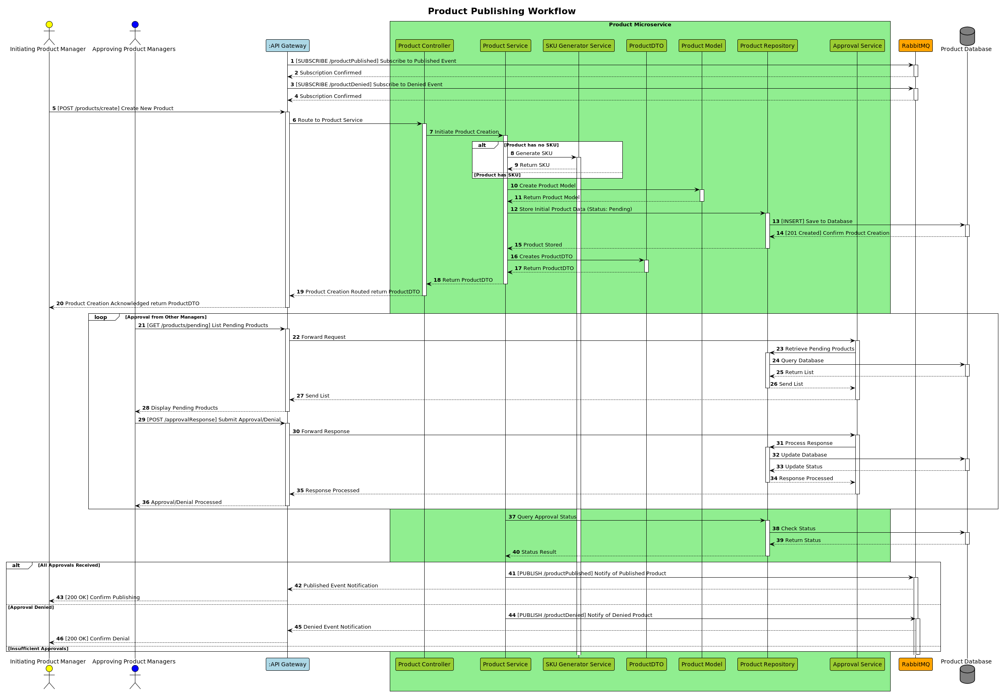

This diagram outlines the Product Publishing in the ProductReview application, addressing the functional requirement that a product can only be published after
approval from two other product managers. The process involves several components including product managers, API Gateway, Product Microservice, and external
services like RabbitMQ and the Product Database.

1. **Subscription to Events:**

- The API Gateway subscribes to two RabbitMQ topics: `/productPublished` and `/productDenied`. This setup allows it to receive notifications about the status of
  product publishing.

2. **Product Creation:**

- The initiating product manager sends a request to create a new product via the API Gateway.
- The API Gateway routes this request to the Product Controller within the Product Microservice.
- The Product Service initiates product creation. If a SKU is not provided, the SKU Generator Service generates one.
- The Product Model is created and stored in the Product Repository, which in turn saves the product data to the Product Database with a status of 'Pending'.

3. **Approval Process:**

- Approving product managers view and respond to pending products through the API Gateway.
- The Approval Service retrieves pending products from the Product Repository and displays them to the approving managers.
- Approving managers submit their approval or denial, updating the product status in the Product Database via the Product Repository.

4. **Final Status Update and Notification:**

- Upon receiving all approvals, the ProductService publishes a `/productPublished` event via RabbitMQ, notifying that the product is published. The API Gateway
  confirms this to the initiating product manager.
- If a product is denied or insufficient approvals are received, it remains in the pending state or is marked as denied, and appropriate notifications are sent.

This process ensures that a product is published only after receiving the necessary approvals, adhering to the specified functional requirement. The use of
microservices (Product service) and messaging (RabbitMQ) provides a decentralized and scalable solution. It also ensures efficient, traceable, and maintains the
system's integrity by handling different outcomes (approval, denial, pending status) distinctly.

The workflow encapsulates necessary checks and balances to ensure that the product publishing process is collaborative, as required by the project’s criteria.

### Review Publishing Process:

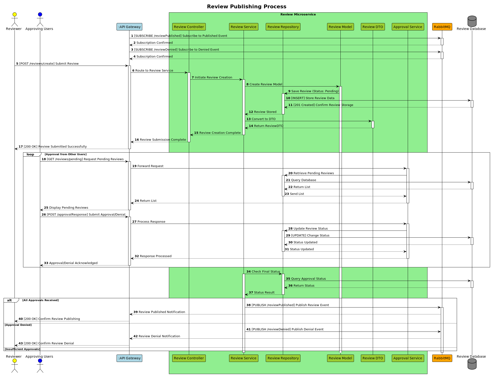

This diagram illustrates the Review Publishing Process in the ProductReview application, addressing the functional requirement that a review must be published only
if it is accepted by two other users recommended for that review. The process involves multiple components, including reviewers, approving users, API Gateway, Review
Microservice, and external services like RabbitMQ and the Review Database.

1. **Subscription to Events:**

- The API Gateway subscribes to two RabbitMQ topics: `/reviewPublished` and `/reviewDenied`. This ensures that it receives notifications regarding the status of
  review publishing.

2. **Review Submission:**

- The reviewer submits a review through the API Gateway.
- The API Gateway forwards this to the Review Controller in the Review Microservice.
- The Review Service initiates the creation of the review, which is stored in the Review Repository and saved in the Review Database with a 'Pending' status.

3. **Approval Process:**

- Other users, identified as the approving users, interact with the system to view and respond to pending reviews.
- The Approval Service retrieves the list of pending reviews and displays them to the approving users.
- Approving users submit their responses (approval or denial), which are processed and update the review status in the database.

4. **Final Status Update and Notification:**

- The Review Service checks the final status of the review.
- If all necessary approvals are received, a `/reviewPublished` event is published via RabbitMQ, confirming the review's publication.
- If the review is denied or lacks sufficient approvals, the appropriate notification is sent, and the review remains in a pending state.

The outlined process ensures that a review is published only after the required approvals, fulfilling the specified functional requirement. This workflow leverages
the microservices architecture by segregating the approval and review process, enhancing modularity and scalability. The utilization of messaging (RabbitMQ) for
event notifications ensures a responsive and efficient system, maintaining the integrity of the review publishing process.

The workflow provides a structured and collaborative approach to review publication, aligning with the project's strategic goals and functional requirements.

## 4+1 + C4 Model Diagrams

The architecture is documented using a combination of the 4+1 model and the C4 model, providing a comprehensive view of the system at different levels. The following
diagrams have been included:

### Level 1 Diagrams

#### Use Cases
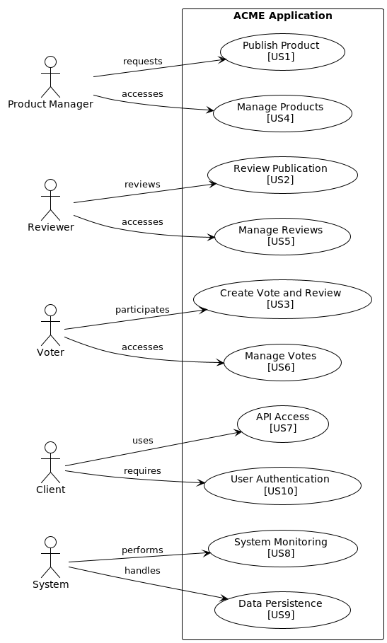
*Overview of system use cases, depicting interactions between users and the system.*

#### Logical View
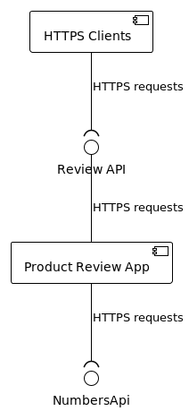
*High-level component diagram showing the main components of the system.*

#### Process View - Product Publishing
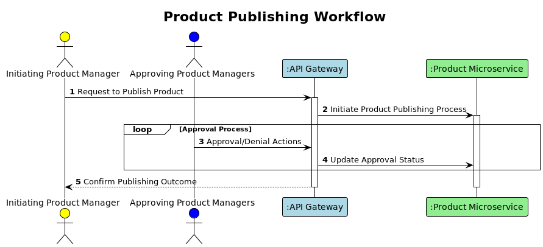
*Process flow for publishing a product, illustrating steps from creation to publication.*

#### Process View - Review Publishing
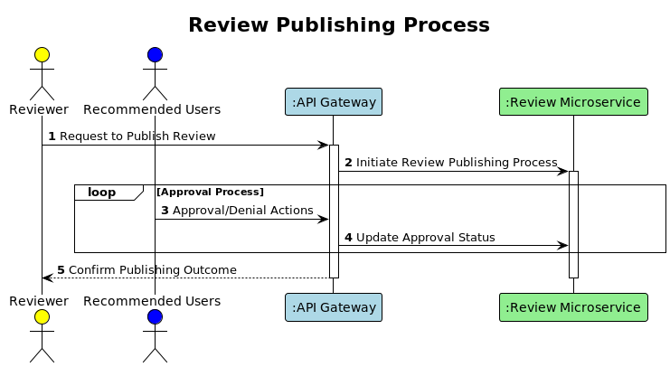
*Process flow for publishing a review, detailing the steps involved in review submission and approval.*

#### Process View - Logging In
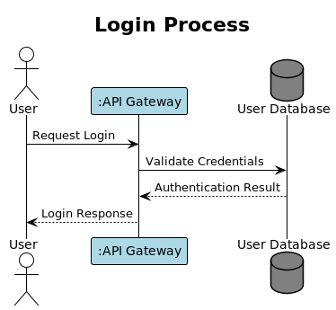
*Illustrates the login process, from user authentication to access grant.*

### Level 2 Diagrams

#### Logic View
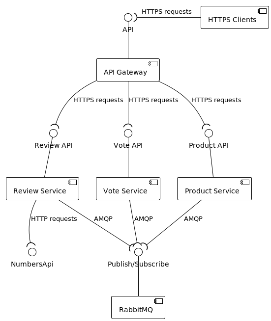
*Detailed component diagram showcasing the architecture's logical structure.*

#### Deployment View

*Deployment diagram showing how the system components are distributed across servers and environments.*

#### Packages View
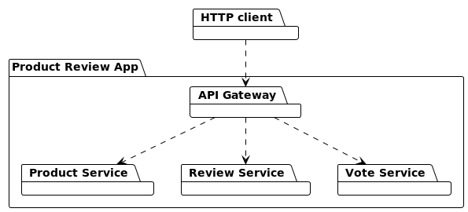
*Package diagram representing the organization of system components into packages.*

#### Process View - Product Publishing
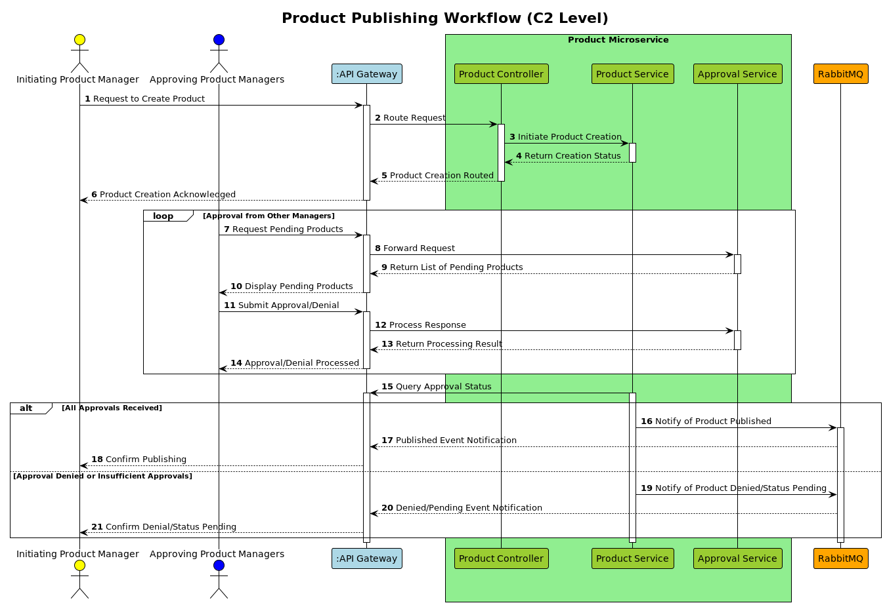
*Detailed process flow for product publishing, including interactions with different system components.*

#### Process View - Review Publishing
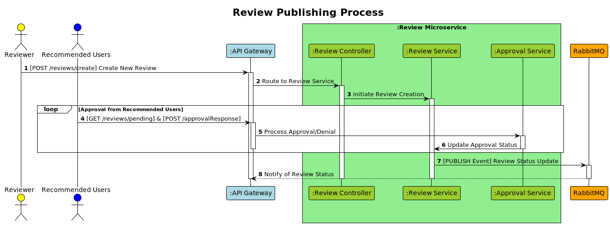
*Expanded view of the review publishing process, highlighting interactions and decision points.*

#### Process View - Logging In
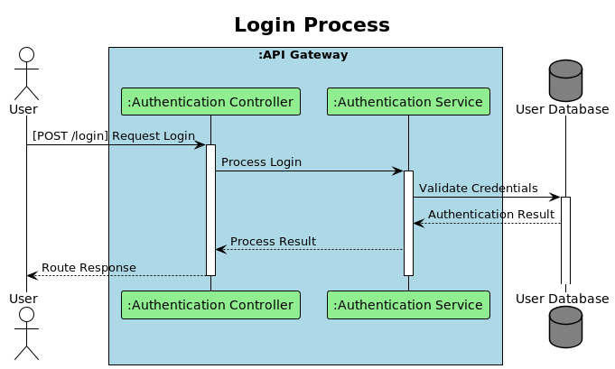
*In-depth illustration of the login process, showing detailed interactions and steps.*

### Level 3 Diagrams

#### Logic View - api-gateway
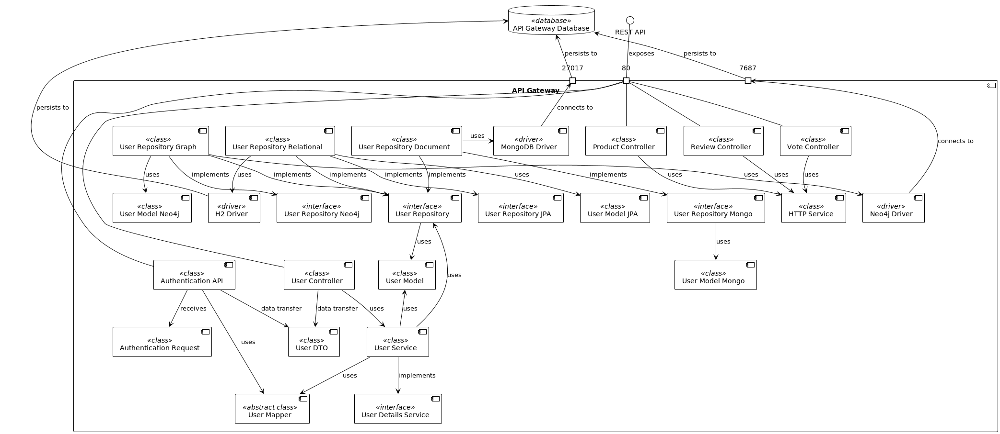
*Component diagram focusing on the API Gateway, detailing its internal structure and connections.*

#### Logic View - product-service
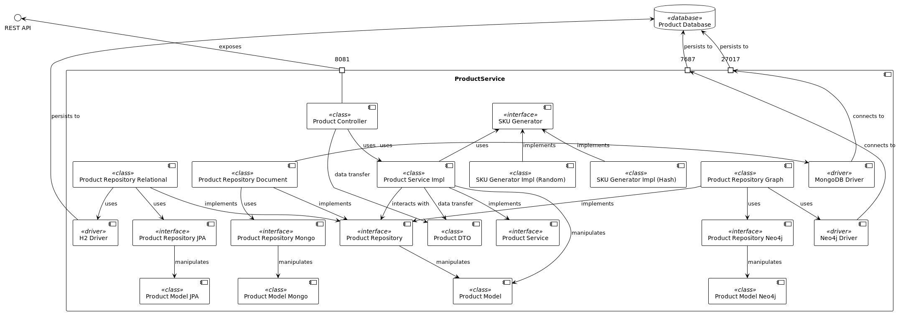
*Component diagram of the Product Service, showing its internal components and their relationships.*

#### Logic View - review-service
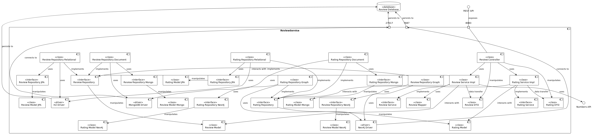
*Detailed structure of the Review Service, highlighting its components and interactions.*

#### Logic View - vote-service
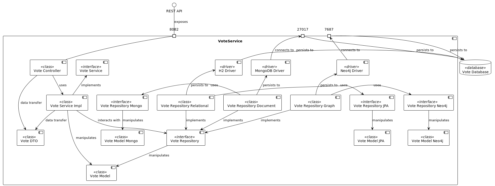
*Component diagram of the Vote Service, illustrating its architecture and component interactions.*

#### Packages View - api-gateway
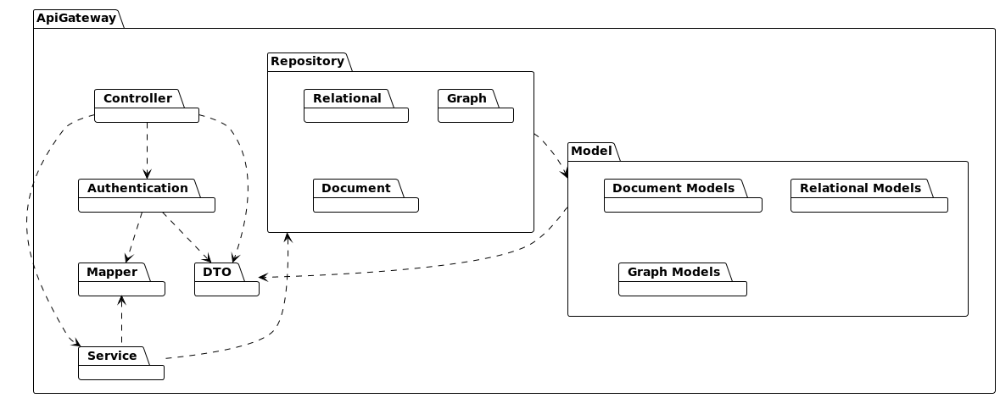
*Package organization within the API Gateway, showcasing its modular structure.*

#### Packages View - product-service
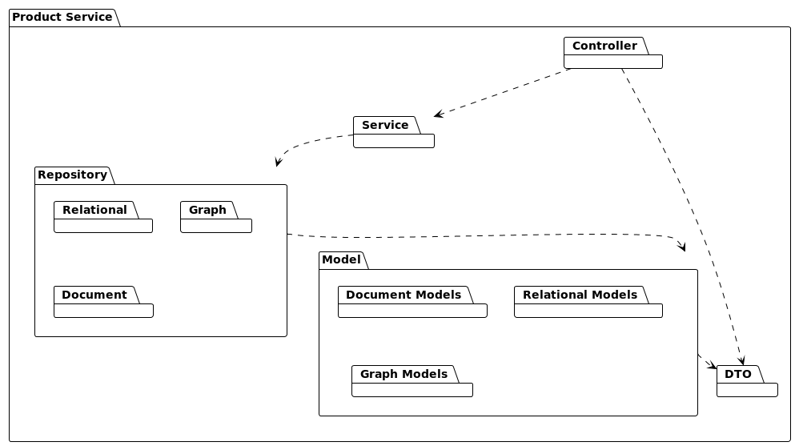
*Illustrates the package structure of the Product Service, detailing its organizational layout.*

#### Packages View - review-service
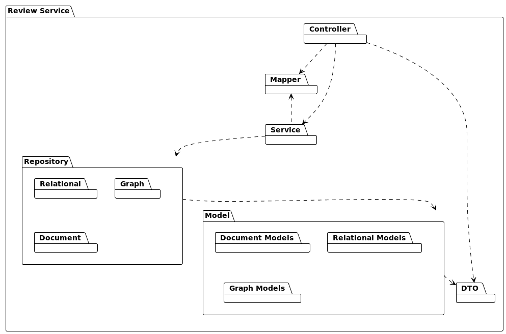
*Package diagram for the Review Service, showing how its components are grouped.*

#### Packages View - vote-service
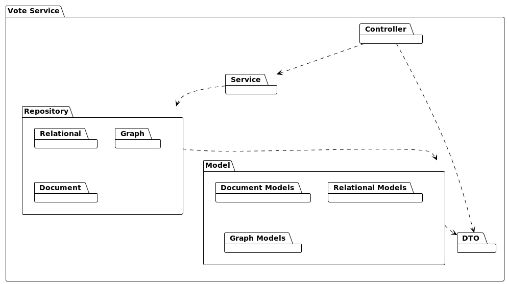
*Shows the package organization of the Vote Service, detailing its modular structure.*

#### Logic + Packages - api-gateway

*Combined package and component view of the API Gateway, providing a comprehensive architecture overview.*

#### Logic + Packages - product-service

*Integration of package and component diagrams for the Product Service, for a holistic view of its architecture.*

#### Logic + Packages - review-service

*Combines component and package diagrams for the Review Service, offering a detailed architectural perspective.*

#### Logic + Packages - vote-service

*Comprehensive diagram integrating both package and component views of the Vote Service.*

#### Mapping - api-gateway
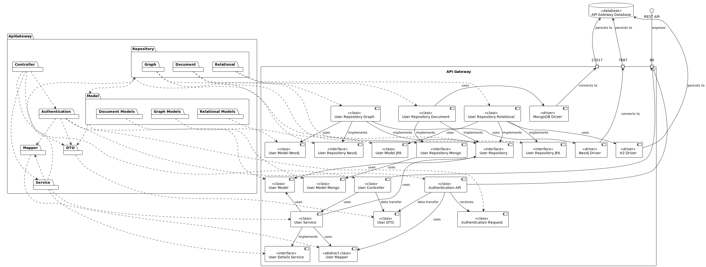
*Mapping diagram for the API Gateway, showing how its components are interconnected.*

#### Mapping - product-service
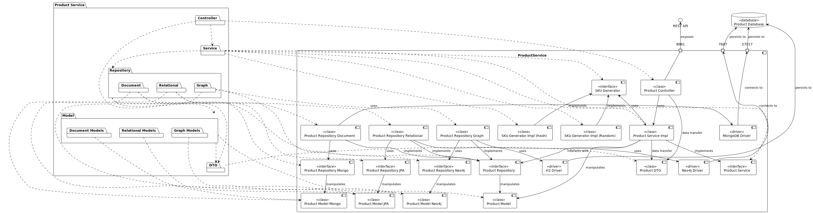
*Depicts the mapping and relationships between components within the Product Service.*

#### Mapping - review-service
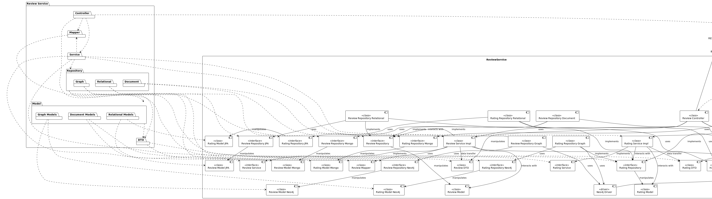
*Illustrates the mapping and interactions of the components in the Review Service.*

#### Mapping - vote-service
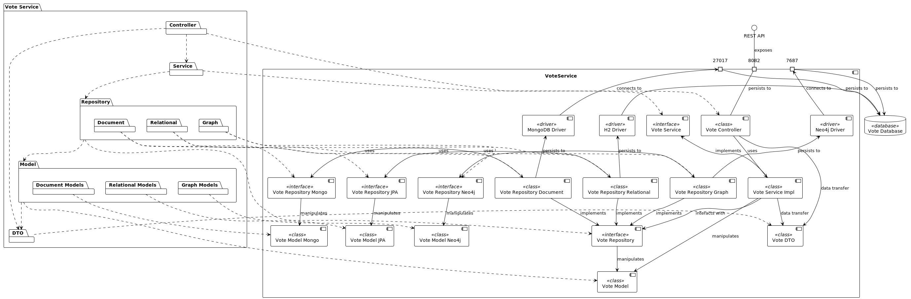
*Mapping diagram for the Vote Service, showcasing component interactions and connections.*

#### Process View - Product Publishing

*Detailed process flow diagram for product publishing in the context of the Product Service.*

#### Process View - Review Publishing

*In-depth process flow for the review publishing mechanism within the Review Service.*

#### Process View - Logging In
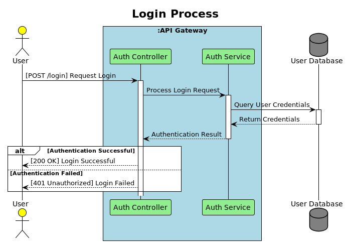
*Detailed process flow diagram illustrating the login mechanism, focusing on user authentication and access control.*
