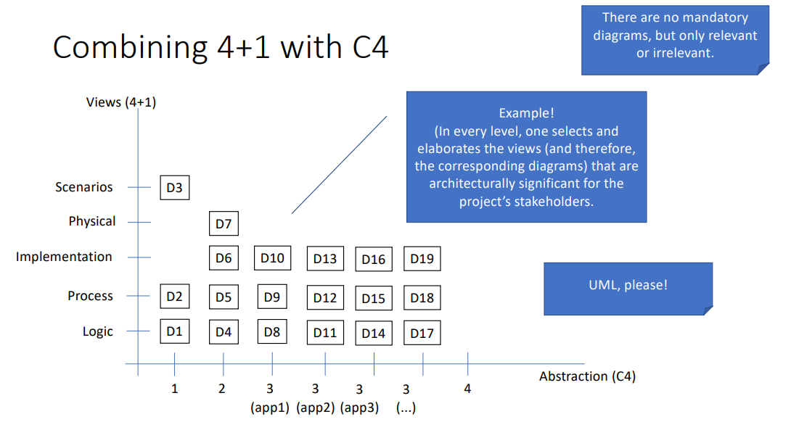

## TODO

- [ ] Final report
- [ ] Update the api gateway diagram to include the new services (ports, etc)
- [ ] Handle load balancer ??
- [ ] Handle RabbitMQ integration (redis maybe too)
- [ ] If possible, try to make the diagrams more organized (the mapping ones are a mess of another world, they look like the labirinth games)

## Diagrams

4+1 + C4 model diagrams

### Levels 1

- [x] level 1 - use cases
- [x] level 1 - logical
- [x] level 1 - Process - `product publishing`
- [x] level 1 - Process - `review publishing`
- [x] level 1 - Process - `Logging In`
- [ ] level 1 - Process - `voting on a review`

### Levels 2

- [x] level 2 - logic
- [x] level 2 - deployment
- [x] level 2 - packages
- [x] level 2 - process - `product publishing`
- [x] level 2 - process - `review publishing`
- [x] level 2 - process - `Logging In`
- [ ] level 2 - process - `voting on a review`

### Levels 3

- [x] level 3 - logic - `api-gateway`
- [x] level 3 - logic - `product-service`
- [x] level 3 - logic - `review-service`
- [x] level 3 - logic - `vote-service`
- [x] level 3 - packages - `api-gateway`
- [x] level 3 - packages - `product-service`
- [x] level 3 - packages - `review-service`
- [x] level 3 - packages - `vote-service`
- [x] level 3 - logic + packages - `api-gateway`
- [x] level 3 - logic + packages - `product-service`
- [x] level 3 - logic + packages - `review-service`
- [x] level 3 - logic + packages - `vote-service`
- [x] level 3 - mapping - `api-gateway`
- [x] level 3 - mapping - `product-service`
- [x] level 3 - mapping - `review-service`
- [x] level 3 - mapping - `vote-service`
- [x] level 3 - process - `product publishing`
- [x] level 3 - process - `review publishing`
- [x] level 3 - process - `Logging In`
- [ ] level 3 - process - `voting on a review`
